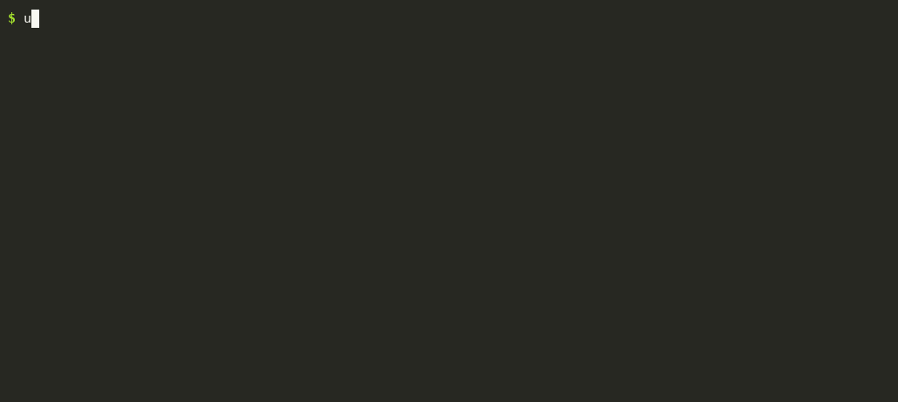

# jevqa

**Five minutes and 35 cents before you show anyone your app.**

Point it at a deployed web app and the README it was built from. It explores the app on its own, then writes `report.md`: the missing delete button, the date field that accepts 1823, the Save that saves nothing, each with a screenshot.

```bash
uvx jevqa run http://localhost:3000 --spec README.md
```



No selectors. No test scripts. Nothing to maintain. The first run asks for two API keys and remembers them.

→ **[See a real report](examples/blog-app/report.md)** from a blog app: 7 findings in 269 seconds, two of them confirmed bugs (no way to edit posts, no way to publish).

## Why it is cheap

Every decision on every screen is a typed judgment from [Jev](https://typesafe.ai), TypeSafe's System One model: a probability or a choice, not generated text, at $0.042 per million tokens. Jev picks the next action and answers a fixed set of oracle questions about each screen. Claude reads your spec once to write the checklist. A full run is 5–6 minutes and $0.29–0.41.

The same job done by a Claude Opus 5 agent with Playwright MCP: $3.20 per app, and it found fewer known bugs. [Benchmark →](BENCHMARK.md)

## What it finds

Measured on 20 [WebTestBench](https://github.com/friedrichor/WebTestBench) apps with 107 known bugs: 22% of them, at 5–6 minutes and $0.29–0.41 per app. In order of how often it finds them:

1. **Missing or unreachable features** — no edit/delete/search/sort control, a role that can only view. Half of everything it finds, and the most reliable half.
2. **Validation gaps** — past dates accepted, bad phone numbers, duplicates, start after end.
3. **Dead controls** — a click that does nothing, "Save" with no effect, a list that does not update after submit.
4. **Data lost after reload.**
5. **Broken first render** — charts of zeros, page errors on entry.

## What it will NOT find

- **Interaction quality**: sliders, drag and drop, animation, keyboard flows. 2 of 15 known interaction bugs.
- **Wrong numbers and wrong content**: a total that is off by one, a stat that lies. It sees text, not truth.
- **Permissions and ownership**: user A editing user B's data. It rarely switches roles deep enough.
- **Long multi-step flows**: checkout, onboarding, anything past 5–6 dependent steps in a 50-action budget.
- **Anything your spec does not mention.** The checklist comes from the spec; a thin README gives a thin run.

**About 1 in 8 findings is a confirmed defect.** The rest is noise or defects the spec does not name. We publish that number because a tool that hides it is lying to you. Read the report top to bottom: missing features come first and are the most reliable; skim the rest in ninety seconds. This is a pre-QA smoke bot. It clears the obvious defects before QA starts; it does not replace QA on UX or business logic.

## GitHub Action

Run it on every preview deployment:

```yaml
- uses: Todmy/jevqa@main
  with:
    url: ${{ steps.deploy.outputs.preview_url }}
    spec: docs/PRD.md
  env:
    TYPESAFE_API_KEY: ${{ secrets.TYPESAFE_API_KEY }}
    ANTHROPIC_API_KEY: ${{ secrets.ANTHROPIC_API_KEY }}
```

The report lands in the job summary and as a workflow artifact. Outputs: `report` (path), `findings` (count).

## Setup

Two keys, asked for on first run and stored in `~/.config/jevqa/config.json` (env vars override, which is what CI uses):

- **TypeSafe** — [console.typesafe.ai](https://console.typesafe.ai). Jev does the exploring and judging: ~$0.05–0.10 per app.
- **Claude** — an [Anthropic API key](https://console.anthropic.com), or pick "use the Claude Code CLI" if you have it logged in. Three calls per app: ~$0.25.

Browser: `uvx --with playwright playwright install chromium` once per machine. `jevqa config` shows or resets the keys.

| flag | default | |
|---|---|---|
| `--spec FILE` | required | spec, PRD or README the app was built from |
| `--steps N` | 50 | action budget; time and cost scale linearly |
| `--out DIR` | `jevqa-runs` | where runs are written |
| `--headed` | off | watch the browser |

Models: Claude Sonnet 5 for the checklist, Haiku 4.5 for form payloads; override with `JEVQA_SONNET` / `JEVQA_HAIKU`.

## How it works

1. Claude turns the spec into 15–30 expectations, each with concrete UI steps.
2. A bounded crawl visits nav, detail and role states. Spec-quoted controls that appear on no screen become **missing feature** findings.
3. The action loop follows scenario steps where Jev can match them to a real element, otherwise explores, and submits boundary payloads (negative numbers, past dates, reversed ranges, duplicates) on every form.
4. After each action Jev answers the oracle questions on the before/after text. Flags are verified by replay; non-reproducible ones are dropped.
5. Each finding becomes one deterministic sentence with Expected / Actual and a screenshot.

## Hosted version?

Today jevqa is a local CLI and an Action, bring your own keys. If you would pay ~$29/month for a GitHub App that comments on pull requests, keeps run history and needs no keys, **[👍 this issue](../../issues/1)**. We build it when enough people do.

## Telemetry

Anonymous counts only (version, step budget, number of findings, seconds, cost estimate). Never the URL, the spec or the report. Off with `JEVQA_TELEMETRY=0`; off by default in CI.

## Add your tester to the benchmark

[BENCHMARK.md](BENCHMARK.md) has the methodology, the leaderboard and how to submit. Nobody else in this category publishes recall. Prove us wrong.

## License

MIT
