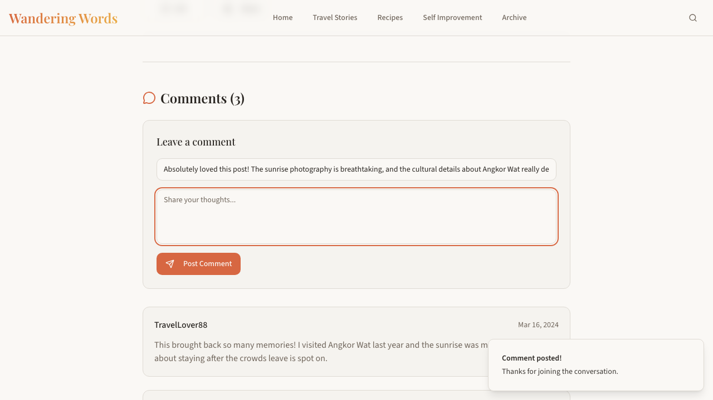
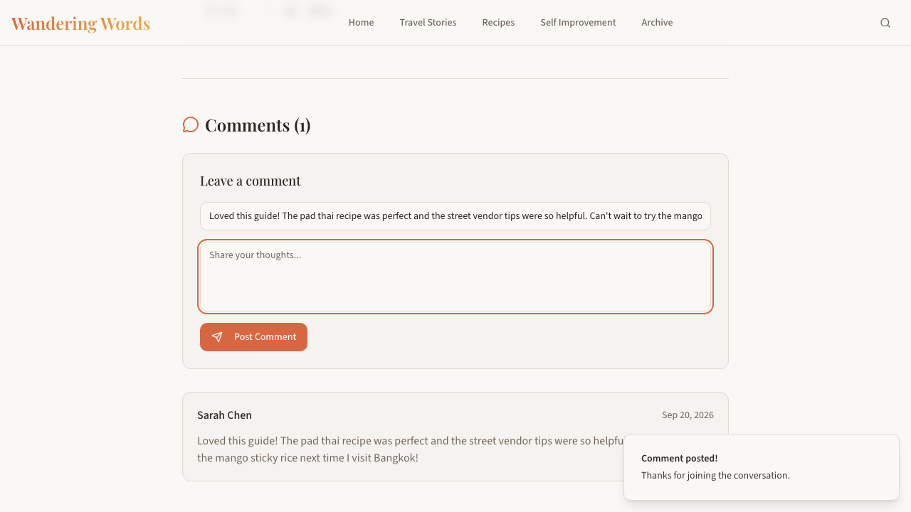

# jevqa report: http://localhost:7600

7 findings · 50 steps · 17 screens · 269s · $0.69 (Jev 156 calls, Claude 4)

Expectations exercised without violation: 6/30. Expect roughly 1 in 8 findings to be a confirmed defect; the rest are noise or defects outside the spec. Triage top to bottom.

## 1. expectation_unreachable

BUG (missing feature): the spec requires "The post is gone from home, archive, category, tag, series, and search results — no orphaned reference remains", but no control, page or content implementing it exists in the app — the tester searched for it over several steps (last page /search) and found nothing to click, fill or read for it.

## 2. expectation_unreachable

BUG (missing feature): the spec requires "Editing the post title updates it in place everywhere it's shown (home, archive, series page) with no duplicate entry", but no control, page or content implementing it exists in the app — the tester searched for it over several steps (last page /search) and found nothing to click, fill or read for it.

## 3. feature_missing

On / the spec requires "I want a personal blog where I can regularly publish articles about travel stories, detailed recipes, and self-improvement guides" but no New Post / Create Article control control or content exists (looked for New Post, Create Post, Add Post, Write Post, New Article among 42 controls and 0 fields).

## 4. feature_missing

On /post/sunrise-over-angkor-wat the spec requires "The admin/editor mode has visible controls for creating, editing, and deleting posts, categories, tags, and series (not just viewing)" but no Edit/Delete controls on the article page control or content exists (looked for Edit, Delete, Remove Post among 28 controls and 2 fields).

## 5. feature_missing

On /post/sunrise-over-angkor-wat the spec requires "simple reactions like “likes,”" but no Like button control or content exists (looked for Like, 👍, React among 28 controls and 2 fields).

## 6. invalid_accepted

BUG: on /post/sunrise-over-angkor-wat, after "form "Post Comment"", an INVALID value was accepted without any validation error. Expected (spec): Submitting a comment with valid text on an article adds it to that article's comment list immediately, visible on reload. Actual: url_changed=False; text that appeared: ["[field Your name='Absolutely loved this post! The sunrise photography is breathtaking, and the cultural details about Angkor Wat really deepened my understanding of the site.'] [field Share your thoughts...='']"]; counters: {}. Details: the tester did: form "Post Comment". Submitted values: {"Your name": "James Mitchell", "Share your thoughts...": "Absolutely loved this post! The sunrise photography is breathtaking, and the cultural details about Angkor Wat really deepened my understanding of the site."}. The payload deliberately violated the rule: duplicate: an identical record was just created, a second identical submit must be rejected. Spec expectation for this step: Submitting a comment with valid text on an article adds it to that article's comment list immediately, visible on reload. Oracle verdict: invalid_accepted. Observed: url_changed=False; added text: ["[field Your name='Absolutely loved this post! The sunrise photography is breathtaking, and the cultural details about Angkor Wat really deepened my understanding of the site.'] [field Share your thoughts...='']"]; counters: {}.

## 7. invalid_accepted

BUG: on /post/street-food-bangkok, after "form "Post Comment"", an INVALID value was accepted without any validation error. Expected (spec): Submitting a comment with valid text on an article adds it to that article's comment list immediately, visible on reload. Actual: url_changed=False; text that appeared: ["[field Your name='Loved this guide! The pad thai recipe was perfect and the street vendor tips were so helpful. Can't wait to try the mango sticky rice next time I visit Bangkok!'] [field Share your thoughts...='']"]; counters: {}. Details: the tester did: form "Post Comment". Submitted values: {"Your name": "Sarah Chen", "Share your thoughts...": "Loved this guide! The pad thai recipe was perfect and the street vendor tips were so helpful. Can't wait to try the mango sticky rice next time I visit Bangkok!"}. The payload deliberately violated the rule: duplicate: an identical record was just created, a second identical submit must be rejected. Spec expectation for this step: Submitting a comment with valid text on an article adds it to that article's comment list immediately, visible on reload. Oracle verdict: invalid_accepted. Observed: url_changed=False; added text: ["[field Your name='Loved this guide! The pad thai recipe was perfect and the street vendor tips were so helpful. Can't wait to try the mango sticky rice next time I visit Bangkok!'] [field Share your thoughts...='']"]; counters: {}.

